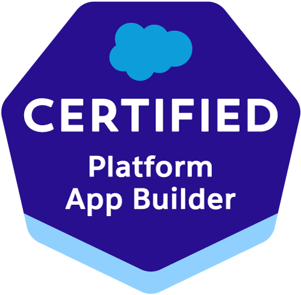

# Alexander D. Steele

    

    

    

    

    

    

## About Me
Welcome to my GitHub! I'm a Talent Developer at SkillStorm, dedicated to upskilling individuals in Salesforce Administration and Development. I'm passionate about leveraging my technical expertise in Apex, Java, SOQL, and more to empower others, foster growth, and accelerate opportunities.

## Technical Proficiencies
- **Languages & Frameworks:** Apex, Lightning Web Components, SOQL, Java, SQL
- **Tools & Platforms:** Salesforce, Linux
- **Salesforce Certifications:** Certified Instructor, Platform Developer I, Platform App Builder, Salesforce Administrator 
- **Other Certifications:** ITILⓇ Foundation, Linux Essentials

## Professional Experience
**Talent Developer | SkillStorm (July 2024 - Present)**
- Facilitate upskilling for individuals in Salesforce Administration and Development, including comprehensive instruction on courses like _ADX201: Essentials for New Lightning Experience Administrators_.
- Explore and apply effective strategies to improve knowledge retention, engagement, and classroom management by reviewing industry articles, resources, and best practices.
- Continuously advance personal expertise in Salesforce certifications and emerging technologies, staying current with industry trends and best practices.

**Salesforce Developer | SkillStorm (April 2024 - July 2024)**
- Designed and implemented custom objects, fields, and flows to enhance Salesforce functionality, ensuring efficient data management and user experience across the organization.
- Developed and maintained Apex code to automate business processes and improve system performance, while adhering to best practices and coding standards.

**IT Contractor | Intech Southwest (May 2023 - April 2024)**
- Providing specialized technical support and strategic IT solutions tailored to client needs.
- Configuring databases for project-specific requirements and ensuring efficient system operations.

## Education
**Western Governors University**
- Bachelor of Science in Computer Science
- Awards: Excellence in Software Design & Quality Assurance, Excellence in Technical Communication

## Projects
- **[Optimal Package Delivery Routing for “WGUPS”](https://github.com/AshimZed/WGUPS)**: A Python application optimizing package delivery with Clarke & Wright's algorithm, featuring a dynamic update system and real-time status tracking.
- **[Interactive Fight Outcome Predictor](https://github.com/AshimZed/Capstone_WGU)**: A Jupyter Notebook interface allowing dynamic interaction and fight outcome predictions based on fighter statistics.

## Interests
When I'm not coding, you can find me exploring the world of Culinary Arts, reading fantasy novels, or diving into continuous learning to satisfy my ever-curious mind.

---

Feel free to connect with me on [LinkedIn](https://www.linkedin.com/in/asteeele00/).
